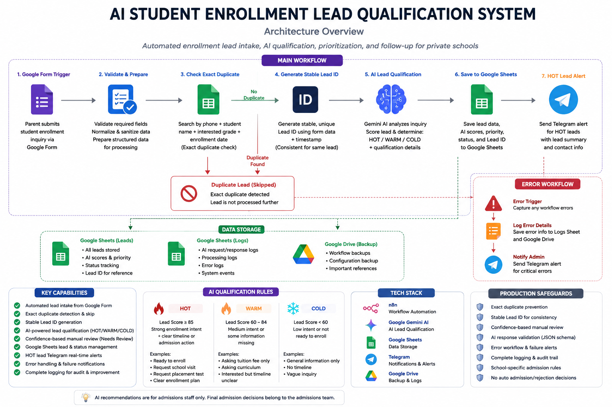
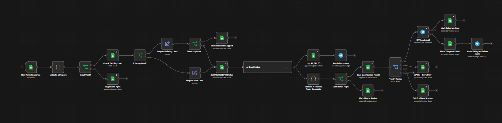

# Private School AI Enrollment Lead Qualification

An n8n-based AI automation system designed to help private school admission teams automatically process, qualify, prioritize, and manage student enrollment leads.

The system receives enrollment inquiries, validates the submitted information, detects duplicate leads, evaluates enrollment intent using Gemini AI, assigns lead priority, stores results in Google Sheets, and alerts admission staff when a high-priority lead is detected.

---

## 🎯 Business Problem

Private schools often receive many student enrollment inquiries through online forms.

Admission teams may need to manually:

- Review every inquiry
- Identify serious enrollment prospects
- Check student information
- Prioritize which parents to contact first
- Handle duplicate submissions
- Track inquiry status
- Notify staff about important leads

This creates unnecessary manual work and can delay follow-up with high-intent parents.

---

## 💡 Solution

This project automates the initial enrollment lead qualification process.

The workflow:

1. Receives a new enrollment inquiry
2. Validates required information
3. Generates a stable lead identity
4. Detects existing and duplicate submissions
5. Skips exact duplicate submissions
6. Sends valid inquiries to Gemini AI
7. Scores and qualifies the lead
8. Applies deterministic business rules
9. Sends low-confidence results for manual review
10. Stores qualification results
11. Routes HOT, WARM, and COLD leads
12. Sends Telegram alerts for HOT leads
13. Handles AI and notification failures

The AI only provides recommendations.

Final admission decisions remain with the school admission team.

---

## 🏗️ Architecture




## 🔄 Workflow Preview



### Main Flow

```text
Google Form
    ↓
Google Sheets Trigger
    ↓
Validate & Prepare
    ↓
Input Valid?
    ↓
Check Existing Lead
    ↓
Existing Lead?
    ├── Existing → Exact Duplicate Check
    │                  ├── Exact Duplicate → Skip
    │                  └── Updated Inquiry → Continue
    │
    └── New Lead → Continue
                       ↓
              Set PROCESSING Status
                       ↓
              Gemini AI Qualification
                       ↓
              Apply Business Guardrails
                       ↓
                Confidence Check
                  ├── Low → Needs Review
                  └── High
                       ↓
              Save Qualification Result
                       ↓
                 Priority Router
              ┌────────┼────────┐
             HOT      WARM      COLD
              ↓
        Telegram Alert
```

---

## ✨ Key Features

### AI Lead Qualification

Gemini AI evaluates each enrollment inquiry and generates structured qualification information such as:

- Lead Score
- Intent Score
- Student Fit Score
- Confidence Score
- Priority
- Qualification Status
- Key Signals
- Missing Information
- Recommended Action

---

### HOT / WARM / COLD Prioritization

Lead priority is determined using business rules.

#### HOT

```text
Lead Score >= 85
+
Strong enrollment intent
+
Clear timeline or admission action
```

Examples:

- Ready to enroll
- Asking how to apply
- Requesting a school visit
- Requesting a placement test
- Clear near-term enrollment plan

#### WARM

```text
Lead Score = 60–84
```

Examples:

- Asking about tuition fees
- Asking curriculum information
- Interested but timeline is unclear

#### COLD

```text
Lead Score < 60
```

Examples:

- General information inquiry
- No clear enrollment timeline
- No clear education requirement

---

## 🛡️ Production Safeguards

The workflow includes several reliability and data-integrity protections.

### Stable Lead ID

The same student keeps the same Lead ID when submitting another inquiry.

This prevents duplicate identities from being created unnecessarily.

---

### Duplicate Key

Each lead is identified using a normalized combination of:

```text
Phone Number + Student Name
```

Example:

```text
09250111222|mgaung
```

This allows the same parent to submit inquiries for different students without overwriting them.

---

### Exact Duplicate Detection

The system creates a submission signature using meaningful form fields.

If the exact same inquiry is submitted again:

```text
Processing Status = DUPLICATE_SKIPPED
AI Status = SKIPPED
```

Gemini is not called again.

This reduces unnecessary AI API usage.

---

### Deterministic AI Guardrails

AI-generated priority is validated using deterministic rules.

```text
Score >= 85 → HOT
Score >= 60 → WARM
Score < 60  → COLD
```

This prevents inconsistencies between the AI score and priority.

---

### Confidence-Based Manual Review

If the AI confidence score is too low, the lead is marked:

```text
Qualification Status = Needs Review
Priority = NEEDS_REVIEW
```

Admission staff can manually review the inquiry before taking action.

---

### Telegram Failure Handling

HOT leads normally trigger a Telegram notification.

If the Telegram notification fails:

```text
Telegram Status = FAILED
```

The workflow records the failure and sends a separate admin alert.

---

### AI Error Handling

If Gemini qualification fails, the workflow logs the failure and alerts the administrator instead of silently losing the lead.

A separate n8n Error Workflow also handles unexpected workflow-level failures.

---

## 🏫 School-Specific Configuration

The demo version uses the following fictional school configuration:

**School:** Bright Future International Private School  
**Location:** Yangon, Myanmar

### Available Grades

- Nursery
- Kindergarten
- Grade 1–10

### Curriculum

Myanmar Curriculum with English Enrichment Program.

### Admission Period

Main intake:

```text
May – August
```

Mid-year enrollment may be available depending on seat availability.

### Basic Grade Guidelines

- Nursery: Age 3+
- Kindergarten: Age 4–5
- Grade 1: Normally Age 6+
- Grade 2–10: Previous grade completion generally required

The configuration can be replaced with the rules of a real private school.

---

## 🧰 Tech Stack

| Technology | Purpose |
|---|---|
| n8n | Workflow orchestration |
| Google Forms | Enrollment inquiry collection |
| Google Sheets | Lead and qualification data storage |
| Google Gemini AI | Lead analysis and qualification |
| Telegram | HOT lead and failure notifications |

---

## 📁 Repository Structure

```text
private-school-ai-enrollment-lead-qualification/
│
├── workflow/
│   ├── private-school-ai-enrollment-lead-qualification.json
│   └── private-school-ai-error-handler.json
│
├── docs/
│   ├── architecture.png
│   └── workflow-preview.png
│
├── README.md
├── .env.example
├── .gitignore
└── LICENSE
```

---

## 📊 Input Data

The enrollment form collects:

- Parent Name
- Phone Number
- Email
- Student Name
- Student Age
- Current Grade
- Interested Grade
- Preferred Enrollment Date
- Interested Program
- Parent Message / Question

---

## 📤 Example AI Output

```json
{
  "lead_score": 91,
  "priority": "HOT",
  "qualification_status": "Qualified",
  "intent_score": 92,
  "student_fit_score": 90,
  "confidence_score": 94,
  "key_signals": "ready to enroll, clear enrollment timeline",
  "missing_information": "",
  "recommended_action": "Contact the parent and arrange an admission consultation."
}
```

---

## 🔐 Security

Do not commit private credentials to this repository.

Before importing or publishing the workflow, remove or replace:

- Google credentials
- Gemini API credentials
- Telegram bot tokens
- Telegram Chat IDs
- Google Sheet IDs
- Private webhook URLs
- Production-specific identifiers

Store sensitive values using n8n Credentials or environment variables.

---

## ⚙️ Setup

### 1. Import the workflows

Import both workflow JSON files into n8n.

```text
private-school-ai-enrollment-lead-qualification.json

private-school-ai-error-handler.json
```

### 2. Configure credentials

Create the required credentials in n8n for:

- Google Sheets
- Google Gemini
- Telegram

### 3. Configure Google Sheets

Prepare the required sheets for:

- Form Responses
- Leads
- Logs / Errors if used

### 4. Update school configuration

Open the `AI Lead Qualification` node and replace the demo school information with your actual school rules.

### 5. Configure Telegram

Set the admission team Chat ID and admin notification Chat ID.

### 6. Test the workflow

Submit a test enrollment inquiry and verify:

```text
Form Submission
→ Lead Processing
→ AI Qualification
→ Google Sheets Result
→ Priority Routing
→ Telegram Notification
```

---

## ⚠️ Limitations

This version does not automatically make admission decisions.

The system is designed to assist admission teams with lead prioritization.

It currently does not include:

- Full CRM integration
- Automatic parent follow-up
- Enrollment lifecycle management
- Advanced analytics dashboard
- RAG / Vector Database
- Automated admission approval

---

## 🚀 Future Improvements

Possible future versions may include:

- Automated follow-up reminders
- Admission pipeline tracking
- Lead lifecycle management
- School CRM integration
- Calendar / school visit scheduling
- Analytics dashboard
- Admission conversion tracking
- RAG-based school knowledge base
- Multi-school configuration
- Historical lead analysis

---

## 📌 Project Status

**Production v1**

Implemented:

- ✅ Stable Duplicate + Lead ID Logic
- ✅ Exact Duplicate Skip
- ✅ Gemini AI Lead Qualification
- ✅ Deterministic Priority Guardrails
- ✅ Confidence-Based Manual Review
- ✅ HOT / WARM / COLD Routing
- ✅ Telegram HOT Lead Alerts
- ✅ Telegram Failure Handling
- ✅ AI Error Handling
- ✅ School-Specific Configuration

---

## 🤖 AI Decision Policy

AI recommendations are intended to support the admission team.

The system does **not** automatically accept or reject students.

> Final enrollment and admission decisions must always be made by authorized school staff.

---

## 📄 License

This project is available for educational, portfolio, and development purposes.